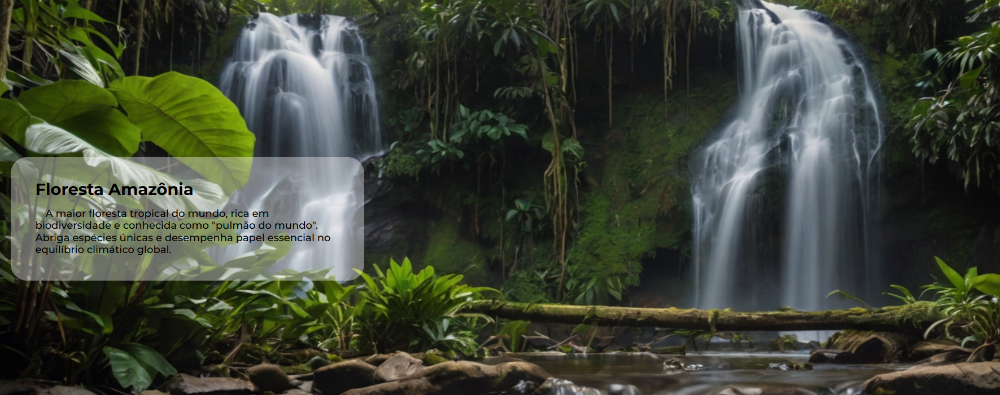

 

# Nome do Projeto

> Este projeto tem como foco principal o uso de JavaScript para criar interações dinâmicas com o usuário. Ele também serve como uma introdução aos seis biomas brasileiros, apresentando informações relevantes de forma interativa.

## Tecnologias

  
  

## Contribuir

1. **Clonar projeto:**: `git clone https://github.com/guicarbar/biomes_webpage.git`
2. **Criar feature/branch:**: `git checkout -b feature/Nome-da-branch`

## Licença

Este projeto está sob a licença [MIT](../LICENSE) License.